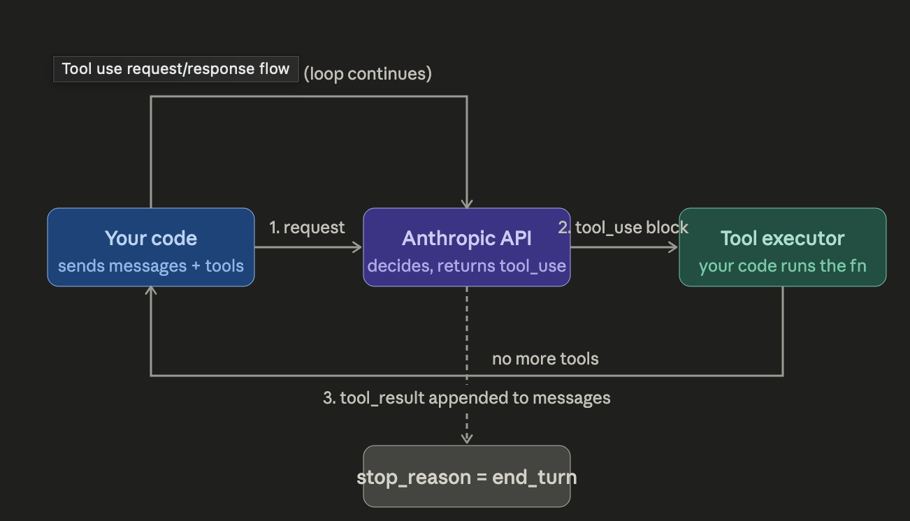
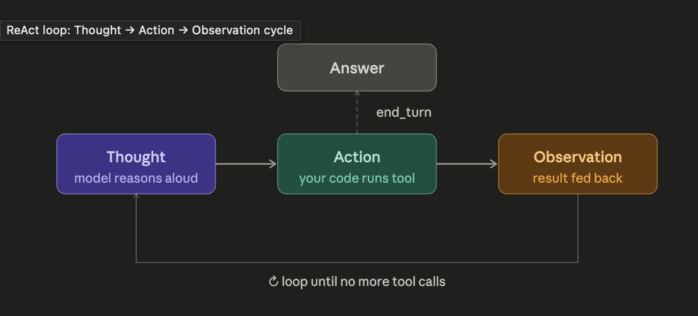

# The LLM API — understand the primitive
Before "agents," just get fluent with the raw API. The key insight is that an LLM call is stateless — it's just a function: messages[] → response. Everything agents do is built on top of this.
What to build: A simple Python script that calls the Anthropic API, passes a conversation history, and prints the response. Add streaming. Understand system, user, and assistant roles deeply.
```python
import anthropic

client = anthropic.Anthropic()
messages = [{"role": "user", "content": "Explain what a CI pipeline does in 2 sentences."}]

response = client.messages.create(
    model="claude-opus-4-5",
    max_tokens=1024,
    system="You are a DevOps expert.",
    messages=messages
)
print(response.content[0].text)
```



Key thing to internalize: The model has no memory between calls. You, the developer, are responsible for maintaining state.

## Tool use — giving the model hands
This is the single most important concept. Tool use (also called "function calling") is how an LLM goes from a text generator to something that can act. The pattern:

1. You describe tools to the model (name, description, input schema)
2. The model decides to call one and returns a structured tool_use block
3. Your code executes the tool and returns the result
4. The model sees the result and continues

What to build: An agent with two tools — get_git_log(repo_path) and check_disk_usage(path). Ask it "is this repo healthy?" and watch it decide which tools to call.
The critical mental model here: the model never actually runs code. It just outputs JSON describing what it wants to call. Your code is the executor. You're always in control.

## The agentic loop — putting it together
Once you have tool use, an "agent" is just a while loop:
```
while True:
    response = call_llm(messages)
    if response wants to use a tool:
        result = run_tool(response.tool_call)
        messages.append(tool_result)
    else:
        break  # model is done
```

That's it. Everything else — memory systems, multi-agent orchestration, RAG — is layered on top of this loop. Getting this loop solid in your head before adding complexity is the most valuable thing you can do.
What to build: A "DevOps assistant" that loops until it can fully answer "what's the status of my system?" — calling multiple tools across multiple turns before giving a final summary.

## Prompt engineering for agents
Agents are far more sensitive to system prompt quality than one-shot completions. As a senior engineer, you'll be tempted to under-specify — resist that. Your system prompt needs to cover:

- Role & goal — what the agent is and what success looks like
- Tool guidance — when to use each tool, and when not to
- Output format — especially for structured data
- Failure handling — what to do when a tool returns an error

The Anthropic prompt engineering guide is worth reading in full at this stage.

## MCP — the connective tissue
Once your tool use is solid, MCP (Model Context Protocol) is the natural next step. It's the standardization layer that lets agents connect to any service — GitHub, Jira, Datadog, Slack — through a consistent interface, without writing custom glue for each one.
Since Claude Code itself runs on MCP, you're already using it. Understanding how to write an MCP server is what unlocks building production-grade DevOps agents that connect to your real infrastructure.

# Reason -- Action (ReAct)

## Four Types of State:
- **In-context memory** — just the message history you pass each turn. Simple, free, limited by the context window (~200k tokens for Claude). Fine for single sessions.
- **External memory (RAG)** — store facts in a vector DB or key-value store; retrieve relevant ones at query time and inject them into the system prompt. Used when: the agent needs to know things that do
- **Episodic memory** — save summaries of past agent runs to a file or DB. At the start of each new session, load relevant past episodes. Used when: you want the agent to remember "last Tuesday the disk usage alert was a false positive caused by log rotation."
- **Scratchpad memory** — give the agent a write_note(key, value) / read_note(key) tool. It manages its own working memory mid-run. Used when: the agent needs to track state across many tool calls without bloating the message history (e.g. tracking which hosts it's already checked during an incident sweep).

Once a single agent + tool loop isn't enough, you compose agents. Two primary topologies:
Orchestrator → subagents — one "manager" agent breaks down a task and delegates to specialist agents.

## How these compose in practice
A production incident triage agent uses all four:

Tool use — calls PagerDuty, Datadog, your runbook store, Slack
ReAct — reasons about what to check next based on what it found
Memory — retrieves past similar incidents from a vector store; writes a scratchpad note when it confirms a hypothesis
Multi-agent — spawns a "log analysis" subagent and a "metrics analysis" subagent in parallel, then synthesizes their findings into a root-cause summary


The structural change from 01_hello_tool is small — same loop, same tools — but two things are new: the system prompt instructs explicit reasoning, and a Trace dataclass captures every thought/action/observation so you can inspect what the agent did and why. That's the thing that makes agents debuggable in production.

> Instruction-following in system prompts is unreliable for hard constraints. (limit to 3 tool calls, but agent still uses 6 calls)

The reliability hierarchy for agent constraints is:
> Code enforcement  >  structured output  >  explicit prompt  >  vague instruction

Anything you actually need to guarantee — rate limits, tool call budgets, output format, timeouts — enforce it in your loop, not in natural language. Use the system prompt to shape how the model reasons, not to enforce hard limits on what it does.


# CI/CD Monitor

03 — CI/CD Monitor
What it does: watches GitHub Actions runs, triages failures, explains root cause in plain English.
Prompt: "The main branch build is failing. What broke and why?"
Tools to build: get_workflow_runs, get_job_logs, get_failed_step, get_commit_diff
MCP opportunity: swap get_workflow_runs and get_commit_diff for the GitHub MCP server — your first taste of consuming an existing MCP server instead of writing the integration yourself.
New pattern: log truncation strategy. CI logs can be 50k lines. You'll build a tail_log(lines=200) + search_log(pattern) pair and teach the agent to search before dumping the whole thing into context.
Production pitfall to learn: the model will hallucinate a root cause if you give it a truncated log that doesn't contain the actual error. The fix is teaching the agent to search for the error pattern explicitly before concluding.

04 — IaC Review Agent
What it does: reads Terraform files, flags security issues, misconfigured resources, and drift from your team's conventions.
Prompt: "Review the changes in this PR's Terraform files for security and compliance issues."
Tools to build: read_tf_file, run_tfsec, run_terraform_plan, compare_to_baseline
New pattern: RAG. Your team's IaC conventions ("all S3 buckets must have versioning", "no public security groups") live in a docs folder. You'll embed them into a vector store and retrieve the relevant rules at query time — injecting only what's needed rather than stuffing everything into the system prompt.
New pattern: structured output. Instead of free-form text, prompt the agent to return findings as JSON: {severity, resource, issue, recommendation}. That output feeds a GitHub PR comment formatter or a Jira ticket creator.
Eval opportunity: this is the first agent where you can write deterministic evals. Create a set of "bad" Terraform files with known issues. Assert that the agent finds each one. This is your first eval harness.

05 — Incident Triage Agent
What it does: receives a PagerDuty alert, investigates metrics and logs, matches against past incidents and runbooks, posts a root-cause summary to Slack with a suggested remediation.
Prompt: "P1 alert: high error rate on payments-service. Investigate and summarize."
Tools to build: get_alert_details, get_metrics(service, window), search_logs(service, pattern), post_slack_message
MCP opportunity: PagerDuty, Datadog, and Slack all have MCP servers. This agent could be entirely MCP-driven with no custom tool implementations.
New pattern: episodic memory. Store summaries of past incidents (what fired, what the root cause was, how it was resolved) in a vector store. At triage time, retrieve similar past incidents and inject them — "last time this alert fired it was a database connection pool exhaustion, here's what fixed it."
New pattern: time budget enforcement. Incidents have SLAs. You'll implement the code-side tool call budget from the earlier lesson — if the agent hasn't concluded in 8 tool calls, inject "time limit reached, summarize with what you have."
Production pitfall to learn: alert context is often wrong or stale. The agent needs to verify the alert against live metrics before concluding — teach it to always pull current data, not just trust the alert payload.

06 — PR Review Bot (Multi-agent)
What it does: reviews a pull request using three specialist subagents in parallel, then synthesizes a combined review comment.
Architecture:
Orchestrator
├── Security agent     → finds vuln patterns, secret leaks
├── Test coverage agent → checks what's tested vs what's changed  
└── Style agent        → enforces conventions, flags complexity
New pattern: fan-out + synthesis. The orchestrator spawns three agents concurrently (asyncio.gather), collects their structured JSON findings, then synthesizes a final review. Each subagent has a narrow system prompt and only the tools it needs — the security agent never touches test files.
New pattern: trust boundaries. The style agent can read files. The security agent can read files and run semgrep. Neither can write to the repo or post comments — only the orchestrator can do that, after reviewing the subagents' findings.
Production pitfall to learn: subagent output quality varies. Build a validation step in the orchestrator — if a subagent returns malformed JSON or "I couldn't find any issues" on a large diff, flag it rather than silently passing it through.

07 — Release Manager (Human-in-the-loop)
What it does: prepares a release — generates changelog from commits, tags the release, drafts the announcement, and creates a rollback plan — but pauses for human approval before any write operation.
New pattern: human-in-the-loop gates. The agent runs autonomously up to any destructive or irreversible action, then pauses and presents its plan for approval before continuing. This is the pattern that makes agents safe to run against production infrastructure.
Agent: "I'm ready to tag v2.4.1 and push to production. 
        Here's the changelog and rollback plan. Approve? [y/n]"
Human: y
Agent: [proceeds with tag + deploy]
New pattern: plan-then-execute. The agent first produces a full plan as structured output (what it will do, in what order, what each step's rollback is), gets approval, then executes. No write operations happen during planning.
Production pitfall to learn: approval fatigue. If the agent asks for approval on every minor step, humans start rubber-stamping. Design the approval gates carefully — one approval for the plan, not one per action.

The through-line
By the end of 07 you'll have built every major production concern:
ConcernIntroduced inTool design + log handling03RAG + structured output + evals04Memory + time budgets05Multi-agent + trust boundaries06Human-in-the-loop + plan/execute07

## Large Tool Catalog Problem
Latency — larger context = slower first token.

**Strategy 1 — Tool allowlisting (what we'll use)**

The mcp_servers parameter accepts an allowed_tools filter. You explicitly declare the subset of MCP tools your agent is allowed to use:

```python
mcp_servers=[{
    "type": "url",
    "url": "https://gitlab.com/api/mcp",
    "name": "gitlab",
    "allowed_tools": [
        "list_pipelines",
        "get_pipeline",
        "get_job_log",
        "list_merge_requests",
    ]
}]
```

**Strategy 2 — Tool routing by phase**
For multi-phase agents, pass different tool subsets at different loop stages. Investigation phase gets read tools; action phase gets write tools:

```python
INVESTIGATE_TOOLS = ["list_pipelines", "get_pipeline", "get_job_log"]
ACT_TOOLS        = ["create_mr_comment", "create_issue"]

# Phase 1: investigate with read-only tools
response = client.messages.create(..., allowed_tools=INVESTIGATE_TOOLS)

# Phase 2: act with write tools only
response = client.messages.create(..., allowed_tools=ACT_TOOLS)
```

**Strategy 3 — Dynamic tool selection**
For advanced cases, run a cheap "router" call first — a fast, cheap model call that reads the user's prompt and returns which tools are needed. Then pass only those tools to the main agent:

```python
def select_tools(prompt: str, all_tools: list) -> list:
    """Use a fast model call to pick relevant tools before the main agent runs."""
    response = client.messages.create(
        model="claude-haiku-4-5-20251001",  # fast + cheap for routing
        max_tokens=256,
        messages=[{
            "role": "user",
            "content": f"Given this task: '{prompt}'\nWhich of these tools are needed? {[t['name'] for t in all_tools]}\nReturn only a JSON list of tool names."
        }]
    )
```