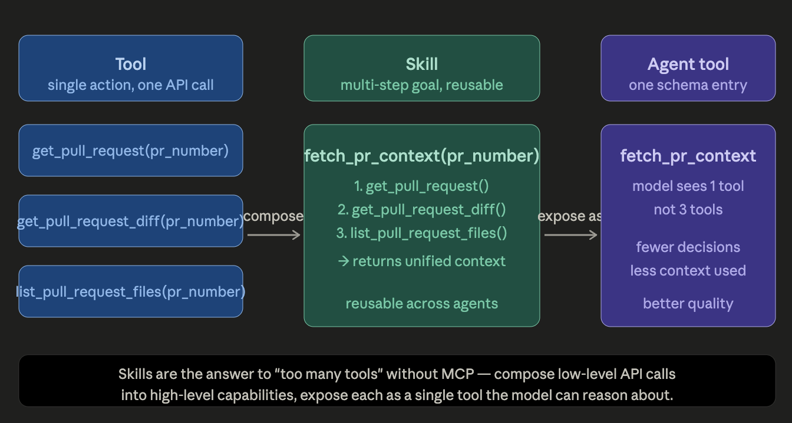

# Skill

## Introduction



A skill is a reusable, multi-step capability exposed as a single tool. Instead of giving the model 8 individual GitHub API tools and hoping it calls them in the right order, you write a fetch_pr_context skill that calls all three internally and returns one unified result. The model makes one decision instead of three, uses less context window, and produces more consistent behavior.This also solves the Bedrock problem elegantly — you're not losing MCP, you're replacing the "MCP server abstracts away API complexity" benefit with "skills abstract away API complexity" in pure Python.

## The boundary in one sentence
A tool is a single, atomic capability. A skill is a reusable, multi-step workflow that achieves a goal.
The distinction isn't about complexity — it's about whether the thing has internal orchestration logic that you want to hide from the model.

Applied to your examples

| Function | Atomic? | Internal steps? | Verdict |
|---|---|---|---|
| `get_pull_request()` | ✅ | None — one API call | Tool |
| `get_pull_request_diff()` | ✅ | None — one API call | Tool |
| `fetch_pr_context()` | ❌ | meta + files + diff → unified result | Skill |
| `fetch_existing_comments()` | ✅ | One API call, light formatting | Borderline — leans Tool |
| `post_review()` | ❌ | format → approval gate → post | Skill |

**A cleaner boundary**
```
Tool   = one external call, one responsibility
         → atomic, stateless, no decisions inside

Skill  = orchestrates multiple tools/calls to achieve a goal
         → has internal logic, hides sequencing from the model
```

**The practical test**
Ask yourself: "Is there logic here I want to keep the model away from?"

- Sequencing: "always fetch meta before diff" → hide it in a skill
- Fallback: "if diff is too large, summarise first" → hide it in a skill
- Side effects: "format, then get human approval, then post" → hide it in a skill
- One API call with light formatting → just a tool, no hiding needed

If the answer is no — if there's nothing to hide — it's a tool. Making it a skill just adds class boilerplate for no benefit.


## Prompt-driven vs Code-driven

**Code-driven skills** — orchestration lives in your Python. The model decides what to do; your code decides how.
```python
class FetchPRContextSkill(Skill):
    def execute(self, repo, pr_number):
        meta  = self._get_metadata(repo, pr_number)   # always
        files = self._get_files(repo, pr_number)       # always
        diff  = self._get_diff(repo, pr_number)        # always
        return self._format(meta, files, diff)         # always

# Result: 1 tool call, 1 model decision, always gets all three pieces.
```

**Prompt-driven skills** — orchestration lives in the system prompt. The model decides what to do and how to sequence it.
```python
# No FetchPRContextSkill class at all.
# Instead, the system prompt says:

"""
When reviewing a PR:
1. Call get_pull_request to get metadata
2. Call get_pull_request_files to see what changed  
3. Call get_pull_request_diff to read the changes
4. Synthesize into a review
"""

# And you give the model 3 raw tools instead of 1 skill. Result: 3 tool calls, 3 model decisions, model might skip step 2 on a small PR.
```

### The real differences
**Reliability.** Code is deterministic. If FetchPRContextSkill calls three APIs, it always calls those three APIs in that order. A prompt instruction is a suggestion — the model follows it most of the time, skips steps when it "decides" they're unnecessary, and occasionally ignores the order entirely.
```
Code:   fetch_metadata → fetch_files → fetch_diff   (every time, guaranteed)
Prompt: fetch_metadata → fetch_diff                  (skipped files, "seemed redundant")
```

**Debuggability.** When a code-driven skill fails, you get a Python traceback pointing to a line. When a prompt-driven skill fails, you get a wrong answer and have to read the trace to figure out which step the model skipped or misinterpreted.

**Adaptability.** The model can adapt prompt-driven steps to the situation. A code-driven skill does the same thing regardless of context — it can't decide "this diff is small enough that I don't need to fetch the full file context."

**Token cost.** Prompt instructions are cheap — a few hundred tokens in the system prompt. Code-driven skills make real API calls, each consuming latency and potentially adding large tool results to the context window.


### Which is better?

Neither — they solve different problems. The experienced answer is: use code when you need guarantees, use prompts when you need flexibility.

```
Use CODE when:
  ✓ Steps must always happen (fetch A before B, always)
  ✓ The logic is complex enough to test (conditionals, error handling)
  ✓ You need retry/timeout/fallback behaviour
  ✓ The sequence is an implementation detail the model shouldn't see
  ✓ Correctness is more important than adaptability

Use PROMPTS when:
  ✓ The model should adapt the approach to the situation
  ✓ The "steps" are really thinking guidance, not procedure
  ✓ You want the model to decide whether a step is even needed
  ✓ Flexibility matters more than guaranteed behaviour
  ✓ You're still exploring what the right sequence even is
```

### Best Practice

The best production agents use both — at different layers:
```
System prompt (prompt-driven):
  "When reviewing a PR, start with context before forming opinions.
   Only fetch file content if the diff is ambiguous."
  → guides high-level reasoning and judgment calls

Skills (code-driven):
  FetchPRContextSkill  → guaranteed: meta + files + diff, always complete
  PostReviewSkill      → guaranteed: format → approval → post, never skipped

Raw tools (model decides when to use):
  get_file_contents    → model calls this only when it judges more context needed
  get_existing_comments → model calls this only when it seems relevant
```

The prompt handles judgment. The code handles procedure. Raw tools handle opportunistic lookups.

## For your learning project specifically
Your current prototype is code-heavy, which is the right call for learning — it makes behaviour predictable and testable. As you move toward production, the interesting work is finding the right split:

- Which steps are truly procedural? → code them
- Which steps are really judgment calls? → prompt them
- Which steps are opportunistic? → raw tools

A good exercise: take FetchPRContextSkill and ask "what if the diff is 50k tokens?" A code-driven skill always fetches it. A prompt-driven approach might let the model decide to fetch just the file list first and only pull the diff for files that look risky. That adaptability is where prompt-driven shines — and where pure code falls short.